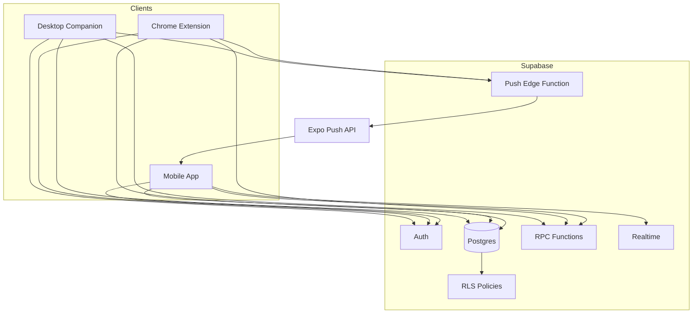

# Tether Architecture

Tether is a peer accountability app. The product promise is simple: a group agrees on allowed work targets, and members can see when each other is actively working on those targets.

The implementation has three clients and one managed backend:

- Mobile app: main user interface.
- Chrome extension: browser activity sensor.
- Desktop companion: desktop app activity sensor.
- Supabase: auth, database, permissions, realtime updates, RPCs, and the push edge function.

## System Diagram

## What Each App Does

### Mobile App

Path: `tether-mobile/`

The mobile app is the main product. Users sign up, create or join tethers, manage rules, view the group board, inspect logs, register push tokens, and check companion status.

Important areas:

- `app/`: screens and routes.
- `components/`: board, rules, logs, and settings UI.
- `contexts/AuthContext.tsx`: mobile auth state.
- `hooks/useTetherBoard.ts`: board loading, realtime refresh, and polling fallback.
- `lib/`: Supabase client helpers for tethers, allowlists, members, push, status, and detected tools.

### Chrome Extension

Path: `tether-extension/`

The extension watches Chrome tabs, checks whether the active URL matches the user's allowlist, and syncs allowed browser work to Supabase. It is login-only; sign-up happens in the mobile app.

Important areas:

- `background.js`: extension lifecycle, tab/window/idle listeners, and alarms.
- `lib/api.js`: Supabase auth and REST/RPC calls.
- `lib/allowlist.js`: allowed target cache and URL matching.
- `lib/sync.js`: active tab and session sync.
- `lib/sessions.js`: browser work-session lifecycle.
- `lib/notify.js`: work-start push trigger.

### Desktop Companion

Path: `tether-desktop-py/`

The desktop companion watches foreground desktop apps. It also scans installed apps so tether creators can allowlist apps from each member's machine.

It is written in Python. The OS-specific code and the user interface are both thin shells around logic that does not know which platform it is on, so the same tracker runs behind the CLI and the window, and both are testable without a Mac, a PC, or a display.

Important areas:

- `src/tether_desktop/tracker.py`: the polling state machine that opens, updates, and closes work sessions.
- `src/tether_desktop/matching.py`: pure allowlist matching, the logic that decides whether activity counts.
- `src/tether_desktop/service.py`: wires auth, device registration, detected app upload, and tracking together for both shells.
- `src/tether_desktop/platforms/`: `darwin.py` and `win32.py` behind one Protocol in `base.py`.
- `src/tether_desktop/cli.py`: terminal interface, including a read-only `check` preflight.
- `src/tether_desktop/ui/webview_window.py` and `ui/web/`: the desktop window, rendered in the OS webview so its styling matches the mobile app's design tokens. `ui/window.py` is a plain Tkinter fallback for machines with no webview runtime.

The Supabase layer is split by concern: `auth.py`, `devices.py`, `detected_tools.py`, `sessions.py`, and `notify.py`.

#### Replacing the Electron companion

`tether-desktop/` is the previous Electron implementation. It writes to the same tables and RPCs and still works, but new work belongs in `tether-desktop-py/`. Two behavioral differences to know about:

- The Python version does not yet handle sleep and lock events, which Electron got free from `powerMonitor`. It falls back to the idle threshold, so a session can stay open slightly longer after a lid close. Native `NSWorkspace` and `WM_POWERBROADCAST` handling is the follow-up.
- The Python version finds more apps. On macOS it follows symlinks and reads binary `Info.plist` files, both of which the old `plutil` call missed. On Windows the PowerShell helper-path regex was invalid for .NET, and because every use sat inside a `try/catch`, the recursive executable, Steam, and process scans silently returned nothing.

The Electron version should be removed once the Python one has been verified on real Windows hardware.

### Supabase

Path: `supabase/`

Supabase is the backend. There is no separate Node, Express, or Next.js API server.

Important areas:

- `migrations/`: database schema, RLS policies, Realtime setup, and RPC functions.
- `functions/send-work-started-push/index.ts`: edge function that sends Expo push notifications to tether peers.

## Main Data Flow

1. A user signs up in the mobile app through Supabase Auth.
2. The user creates or joins a tether.
3. The tether creator adds allowed websites and desktop apps.
4. The Chrome extension and desktop companion fetch allowed targets through Supabase RPCs.
5. When a user opens an allowed target, the extension or companion writes activity to Supabase.
6. The mobile board reads current activity through RPCs and receives Realtime changes.
7. When work starts, the extension or companion calls the push edge function.
8. The edge function looks up peer push tokens and sends notifications through Expo Push.

## Core Tables

- `profiles`: user display names.
- `tethers`: groups.
- `tether_members`: group membership and delegated allowlist permissions.
- `active_tabs`: current browser activity snapshot.
- `work_sessions`: focus sessions for browser and desktop work.
- `tether_allowed_targets`: allowed domains and apps for a tether.
- `devices`: desktop companion devices.
- `detected_tools`: apps discovered by the desktop companion.
- `push_tokens`: mobile push tokens for Expo notifications.

## Why There Are Three Clients

The mobile app cannot read Chrome tabs or desktop foreground apps. The Chrome extension cannot scan installed desktop apps. The desktop companion cannot run inside Chrome's tab APIs. Each client owns the platform capability that only it can access.

This is why the current architecture is reasonable:

- Mobile owns product UI and push registration.
- Extension owns browser work detection.
- Desktop owns desktop app detection.
- Supabase owns shared state, permissions, and realtime delivery.

## What Should Stay Custom

These are part of Tether's product advantage and should not be replaced casually:

- Allowlist-gated work tracking.
- Peer board status.
- Browser tab detection.
- Desktop foreground-app detection.
- Tether membership and visibility rules.

## What Can Be Improved Later

These are not the core product and can be simplified with managed services if they become painful:

- Error tracking and product analytics.
- Notification orchestration.
- Branded auth emails.
- Desktop packaging and updates.
- More advanced authorization if roles become complex.

## Best Files To Read First

Start here if you are learning the codebase:

1. `README.md`
2. `docs/readiness-checklist.md`
3. `tether-mobile/hooks/useTetherBoard.ts`
4. `tether-mobile/lib/tethers.ts`
5. `tether-extension/background.js`
6. `tether-extension/lib/sync.js`
7. `tether-desktop-py/src/tether_desktop/tracker.py`
8. `supabase/README.md`
9. `supabase/migrations/002_tethers.sql`
10. `supabase/functions/send-work-started-push/index.ts`
